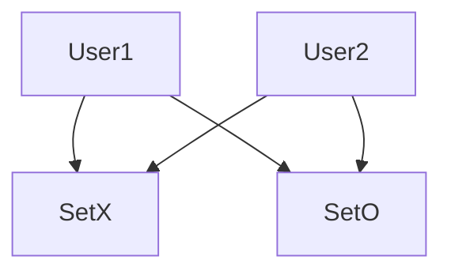

# Planing
The goal is to build a TicTacToe-Multiplayer. The Project will be splitt in the following steps:

* The Base Game Tic-Tac-Toe in Terminal
* The Multiplayer extension
* The GUI 

In the base game everthing will be utilised in the python Terminal. </br>
During the Multiplayer extension the GUI can be started.

## UML
| TicTacToe                                      |
|------------------------------------------------|
| field: list<br/>match: int                     |
| printfield()<br/>playermove()<br/>activegame() |
 
TacTacToe will be changed to TicTacToe-MP (**M**ulti**p**layer)

| TicTacToe-MP                                                   |
|----------------------------------------------------------------|
| field: list<br/>match: int<br/>user: str                       |
| printfield()<br/>playermove()<br/>activegame()<br/>surrender() |

## Use-case Diagram

---

# Tic-Tac-Toe
Before making the game Multiplayer the base game will be Programmed to work for both users on one client in the [TicTacToe.py](./TicTacToe.py) and will later be extended to work in multiplayer on two clients

## The playingfield
To make the editing of the list easier an empty string has been positioned on field[0].
```python
field = [" ",
         "1", "2", "3",
         "4", "5", "6",
         "7", "8", "9"]
```
Because now the player-chosen moves can directly be put into the list.

To output the playingfield like a normal tic-tac-toe field lines have been added.
```python
def printfield(self):
    print(self.field[1] + "|" + self.field[2] + "|" + self.field[3])
    print(self.field[4] + "|" + self.field[5] + "|" + self.field[6])
    print(self.field[7] + "|" + self.field[8] + "|" + self.field[9])
```
## Playermove
to keep track of whos turn it is the variable rep for repetition has been added.
```python
rep = 1
```
To garantie that the user has input an integer between one and nine a try except has been added.
The user also should not be able to take a field which allready has been used so each field is checked if it is occupied by an *X* or *O*.
```python
try:
    move = int(move)
except ValueError:
    print("enter a number\n")
if 1 >= move >= 9:
    print("Value must be between 1 and 9!")
if self.field[move] == "X" or "O":
    print("This field is allready occupied!")
```
If there are no exceptions the players will alternatingly get *X* and *O*'s
```python
else:
    if (rep % 2) == 0:
        self.field[move] = "O"
        rep += 1
    else:
        self.field[move] = "X"
        rep += 1
```
After each move by the player the repetition-counter will be increased by one.

## Check for a winner
To check for a winner the function **checkwinner()** has been added. </br>
For this every single winning condition has been written out with ...
* the first three being the rows
* the next three for the columns
* and the last two for the diagonals
```python
def checkwin(self, rep):
    if (
            (self.field[1] == self.field[2] == self.field[3]) or
            (self.field[4] == self.field[5] == self.field[6]) or
            (self.field[7] == self.field[8] == self.field[9]) or
            (self.field[1] == self.field[4] == self.field[7]) or
            (self.field[2] == self.field[5] == self.field[8]) or
            (self.field[3] == self.field[6] == self.field[9]) or
            (self.field[1] == self.field[5] == self.field[9]) or
            (self.field[3] == self.field[5] == self.field[7])
    ):
```
In case one of the statements has been fullfiled, the player at move will win and the function returns TRUE, if not the function will return FALSE, meaning nobody won yet
```python
if (rep % 2) == 0:
    print("Player O won!")
    return True
else:
    print("Player X won!")
    return True
return False
```
For the case of a draw following lines have been added to the **playermove()** function:
```python
if rep == 10:
    "draw"
    break
```
---
# TicTacToe Multiplayer extension
For the game to work in multiplayer, the socket library will be used.</br>
TicTacToe will be played peer to peer, which means the programm will be either working as client and as server.</br>
When starting the .py the user will be asked if he wants to create or join a game, this will decide if the user is the server or the Client.</br>
Before we can make a server or a client we need to filter the input in the same way as in the base game.
```python
def decider(self):
    while True:
        try:
            choice = str(input("Do you want to create a game (c) or join a game (j): "))
        except ValueError:
            print("Please decide between (c/j): ")
        if choice not in ("c", "j"):
            print("Please decide between (c/j): ")
            continue
```

```python
else:
    if choice == "c":
            s = socket.socket(socket.AF_INET, socket.SOCK_STREAM)
            s.bind(("", 55000))
            s.listen(1)
            print(socket.gethostbyname(socket.gethostname()))
            break
        else:
            ip = input("please enter the IP-Address of the other player: ")
            s = socket.socket(socket.AF_INET, socket.SOCK_STREAM)                s.connect((ip, 55000))
            break
```
After choosing to be the server the user should wait until another player joins. 
```python

```

---

# GUI

The Goal is to play the TicTacToe Multiplayer with a graphic interface

# Modules needed

We need to import modules in order to make the GUI work:

```python
from tkinter import *
from TicTacToe import TicTacToe
import threading
```

The module TicTacToe is the imported function from the TicTacToe script. We need to implement in order to make it
possible to use the functions in the script.

# Button press function

First we need a function that let's the programm know what happens with the Button press. It needs to know if it
has to place a X or an O on the field:

```python
def button_press(row, col):
    if ttt.current_turn == ('X' if ttt.is_host else 'O'): 
        move = row * 3 + col
        if ttt.playermove(move):
            buttons[row][col].config(text=ttt.current_turn, state=DISABLED)
            if ttt.checkwin():
                result = f"Player {ttt.current_turn} won!"
                end_game(result)
            elif ttt.rep == 10:
                end_game("Draw!")
            else:
                ttt.send_move(move)
                ttt.current_turn = 'O' if ttt.current_turn == 'X' else 'X'
                fenster.after(100, wait_for_opponent_move)
```
Where ttt is the Object from the TicTacToe script and is defined a little later:

```python
ttt = TicTacToe("marco")
```
It is checked if the player is the Host. The Host always begins and has the X.
If the player makes a move it is checked with the **playermove** Function. After it is checked the correspondig Button is disabled
and replaced with X or O