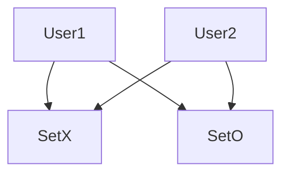

# Planing
The goal is to build a TicTacToe-Multiplayer. The Project will be splitt in the following steps:
* The Base Game Tic-Tac-Toe in Terminal
* The Multiplayer extension
* The GUI 

In the base game everthing will be utilised in the python Terminal.

During the Multiplayer extension the GUI can be started.

## UML
| TicTacToe                                      |
|------------------------------------------------|
| field: list match: int                     |
| printfield() playermove() activegame() |
 
TacTacToe will be changed to TicTacToe-MP (**M**ulti**p**layer)

| TicTacToe-MP                                                   |
|----------------------------------------------------------------|
| field: list match: int user: str                       |
| printfield() playermove() activegame() surrender() |

## Use-case Diagram

___

# Tic-Tac-Toe
Before making the game Multiplayer the base game will be Programmed to work for both users on one client in the [TicTacToe.py](./TicTacToe.py) and will later be extended to work in multiplayer on two clients
