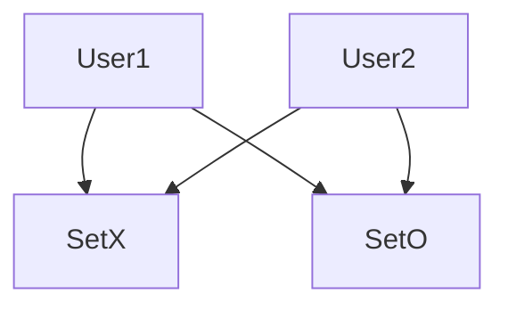

# Planing
The goal is to build a TicTacToe-Multiplayer. The Project will be splitt in the following steps:

* The Base Game Tic-Tac-Toe in Terminal
* The Multiplayer extension
* The GUI 

In the base game everthing will be utilised in the python Terminal. </br>
During the Multiplayer extension the GUI can be started.

## UML
| TicTacToe                                      |
|------------------------------------------------|
| field: list<br/>match: int                     |
| printfield()<br/>playermove()<br/>activegame() |
 
TacTacToe will be changed to TicTacToe-MP (**M**ulti**p**layer)

| TicTacToe-MP                                                   |
|----------------------------------------------------------------|
| field: list<br/>match: int<br/>user: str                       |
| printfield()<br/>playermove()<br/>activegame()<br/>surrender() |

## Use-case Diagram

---

# Tic-Tac-Toe
Before making the game Multiplayer the base game will be Programmed to work for both users on one client in the [TicTacToe.py](./TicTacToe.py) and will later be extended to work in multiplayer on two clients

## The playingfield
To make the editing of the list easier an empty string has been positioned on field[0].
```python
field = [" ",
         "1", "2", "3",
         "4", "5", "6",
         "7", "8", "9"]
```
Because now the player-chosen moves can directly be put into the list.

To output the playingfield like a normal tic-tac-toe field lines have been added.
```python
def printfield(self):
    print(self.field[1] + "|" + self.field[2] + "|" + self.field[3])
    print(self.field[4] + "|" + self.field[5] + "|" + self.field[6])
    print(self.field[7] + "|" + self.field[8] + "|" + self.field[9])
```
## Playermove
to keep track of whos turn it is the variable rep for repetition has been added.
```python
rep = 1
```
To garantie that the user has input an integer between one and nine a try except has been added.
The user also should not be able to take a field which allready has been used so each field is checked if it is occupied by an *X* or *O*.
```python
try:
    move = int(move)
except ValueError:
    print("enter a number\n")
except 1 >= move >= 9:
    print("Value must be between 1 and 9!")
except self.field[move] == "X" or "O":
    print("This field is allready occupied!")
```
If there are no exceptions the players will alternatingly get *X* and *O*'s
```python
else:
    if (rep % 2) == 0:
        self.field[move] = "O"
        rep += 1
    else:
        self.field[move] = "X"
        rep += 1
```
After each move by the player the repetition-counter will be increased by one.

